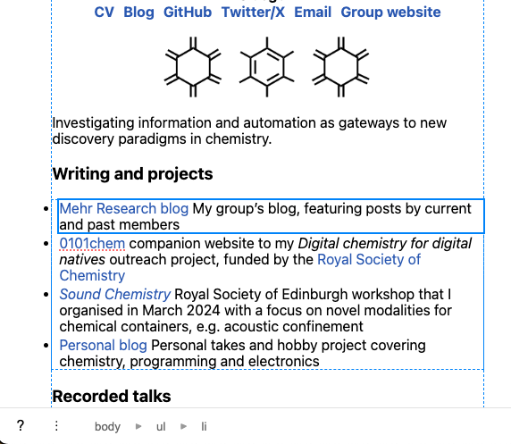

# FemtoEdit
FemtoEdit is a lightweight, keyboard-driven, in-browser WYSIWYG page editor.

## How to use it
1. Go to the [latest release] page
2. Download the bookmarklet file and paste the contents into a new bookmark.
3. Open the page you want to edit.
4. Click the bookmarklet to start editing.

[latest release]: https://github.com/hessammehr/femto_edit/releases/latest